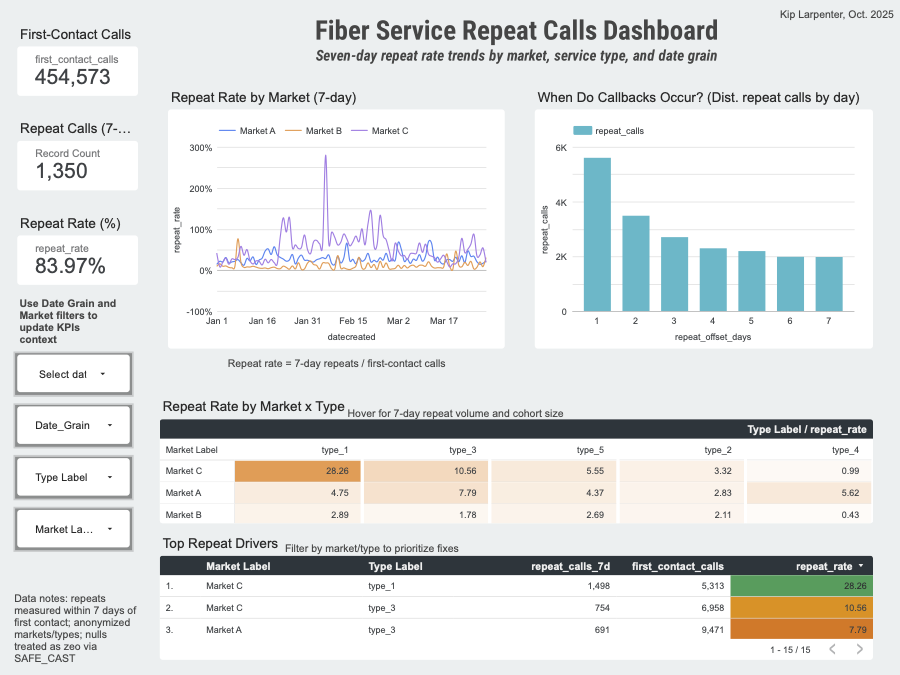

# Google Fiber BI Analysis: Repeat Call Dashboard
## Workplace Scenario Overview
As part of a data analytics assessment, this project delivers an executive-friendly BI dashboard for a fictional Google Fiber customer call center, using anonymized, semi-realistic data to surface seven-day repeat call behavior and its drivers. The solution applies BI methodology (capture, analyze, monitor) to design actionable dashboards that address key customer service challenges.
## Project Background
- **Goal:** Quantify and visualize repeat call patterns to inform improvements in first-contact resolution and post-contact follow-up.
- **Focus Questions:**
  - How often do customers call again within seven days of the first contact?
  - Which problem types generate the most repeat calls?
  - Which markets carry the highest repeat burden and should be prioritized?
## Dataset Details
- **Data Includes:**
  - First-contact call counts per cohort date.
  - Repeat call counts by day offset 1–7 after first contact.
  - Problem type codes (type1–type5) and anonymized market identifiers (market_1–market_3).
  - First-contact date fields used for time-series analysis.
- **Problem Type Categories:**
  - **Type 1:** Account Management
  - **Type 2:** Technician Troubleshooting
  - **Type 3:** Scheduling
  - **Type 4:** Construction
  - **Type 5:** Internet & Wi-Fi
## Stakeholders & Team
- **Primary Stakeholders:** Emma Santiago (Hiring Manager), Keith Portone (Project Manager), Minna Rah (Lead BI Analyst)
- **BI Team Members:** Ian Ortega, Sylvie Essa
## Project Requirements
- Reveal repeat-call volume and root patterns across markets and problem types.
- Enable time-based breakdowns at flexible grains (week, month, quarter, year).
- Provide accessible visuals appropriate for leadership and operations audiences.
- Keep underlying data anonymized while preserving analytical integrity.
- Ensure all stakeholders have access to datasets for review and validation.
---
## Phase 1: Data Capture and Upload
Anonymized call-center extracts were prepared for analysis and staged for BI modeling, ensuring coverage of first-contact dates, market/type dimensions, and seven-day repeat offsets.
### Activities
- Validated structure and ranges for first-contact and repeat-offset metrics.
- Loaded CSVs (market_1, market_2, market_3) into BigQuery staging tables.
- Confirmed shared schema: `date_created`, problem type, market ID, `contacts_n`, and seven repeat-day columns (`contacts_n_1` through `contacts_n_7`).
### Step 1: Initial Upload
Three CSV files representing call-center data across distinct markets were uploaded directly to BigQuery using the console import wizard. Each dataset includes first-contact call volumes and repeat-call counts for each day offset.
### Step 2: Data Validation
Post-upload checks confirmed:
- Consistent row counts with original extracts
- Full population of required columns
- Expected date ranges and numeric distributions
- No schema conflicts across market files
---
## Phase 2: Data Transformation and Modeling
Data from three market tables was combined and transformed in BigQuery for analysis, enabling unified queries across regions and problem types while maintaining data integrity.
### Activities
- Merged market tables into a single analytical view.
- Created calculated fields for total repeat calls and repeat rate metrics.
- Added time-grain fields (week, month, quarter, year) for flexible reporting.
- Validated cross-market consistency in field definitions and grain calculations.
### Transformation Steps
#### 1. Data Merge
Individual market tables were combined using UNION ALL to create a master dataset preserving all regional and problem-type dimensions:
```sql
SELECT * FROM `project.dataset.market_1`
UNION ALL
SELECT * FROM `project.dataset.market_2`
UNION ALL
SELECT * FROM `project.dataset.market_3`;
```
#### 2. Calculated Fields
Repeat rate and aggregate metrics were derived:
- **Total Repeats:** Sum of contacts_n_1 through contacts_n_7
- **Repeat Rate:** (Total Repeats / contacts_n) * 100
- **Market Labels:** Friendly names replacing internal codes
- **Problem Type Labels:** Descriptive names for type1–type5
#### 3. Time-Grain Enhancement
Date fields were expanded to support flexible reporting:
- **Week:** DATE_TRUNC(date_created, WEEK)
- **Month:** DATE_TRUNC(date_created, MONTH)
- **Quarter:** DATE_TRUNC(date_created, QUARTER)
- **Year:** EXTRACT(YEAR FROM date_created)
---
## Phase 3: Dashboard Design and Insights
A Looker Studio dashboard was built to make repeat-call patterns accessible to executives and operations leaders, emphasizing actionable insights over raw data.
### Dashboard Screenshot

### Key Metrics Displayed
- **Repeat Call Rate by Market:**
  - Bar chart showing percentage of customers calling back within seven days per market.
- **Repeat Calls by Problem Type:**
  - Horizontal bar chart ranking problem categories by volume of repeat contacts.
- **Daily Repeat Call Trend:**
  - Line chart tracking repeat rate across dates, highlighting recent improvements or emerging issues.
- **Market–Type Heatmap:**
  - Two-dimensional heatmap identifies the specific market/problem-type combinations with the highest repeat burden.
- **Day-Offset Distribution:**
  - Histogram of callbacks across days 1–7 after first contact to pinpoint follow-up windows.
### Key Insights for Decision-Makers
- **Proactive Follow-Up Opportunity:** Callbacks cluster within the first few days, indicating wins from proactive post-contact messaging and improved first-touch guidance.
- **Targeted Intervention Zones:** Specific market–type pairs drive elevated repeat rates, highlighting where playbook updates and training will yield the fastest gains.
- **Market Prioritization:** Clear variance across markets enables resource allocation to highest-impact areas.
---
## Known Limitations and Follow-Up
- **Time-Grain Selector Edge Case:** A Looker Studio editor constraint flagged DATE_TRUNC as unsupported within a dynamic selector during finalization, blocking the "stacked workload by period" visual in this iteration; a stable workaround (precomputed week/month/quarter/year buckets + selector) is planned for the next update.
- **Friendly Labels in All Sources:** Some charts briefly displayed raw codes (type1–type5) instead of friendly names (e.g., Internet & Wi-Fi) due to cross-source field scope; the mapping exists and will be duplicated wherever necessary for uniform labeling.
- **Seven-Day Window:** Repeat metrics reflect callbacks within seven days of first contact; longer-window repeats are out of scope for this scenario and can be added if stakeholders want broader retention tracking.
---
## Open Questions (for stakeholder review)
1. Which market–type combinations should be prioritized first for intervention based on service goals?
2. What target bands for acceptable repeat rate should be visualized as reference lines on trends/heatmaps?
3. Which specific playbook changes (knowledge-base, technician scripts, follow-up SMS/email) should be piloted in high-repeat segments?
---
## Repository Structure
- **`/images`** - Dashboard screenshots and visualization assets
- **README.md** - This project documentation
---
## Next Steps
- Address known limitations in time-grain selector and label consistency.
- Gather stakeholder feedback on prioritization questions.
- Pilot interventions in identified high-repeat segments.
- Monitor dashboard adoption and iterate based on user feedback.
